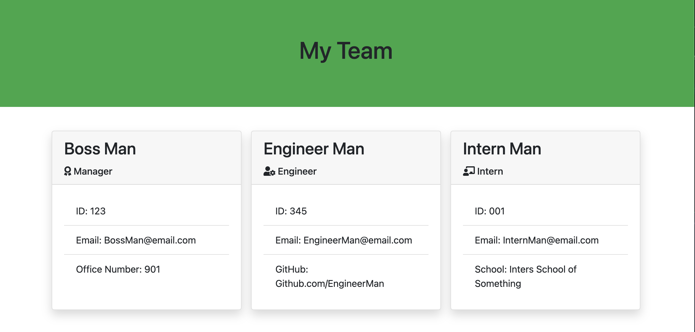

# Team Profile Generator
## Description:
This program will create profile cards for your team members. It will prompt you to choose between a Manager, Engineer or Intern. Under each member type you will be prompted for their Name, Employee ID and Email address. Then, you get one special prompt for each type. Manager gets Office Number, Engineer gets Github Username and Intern gets School name. Once completed, it will generate a HTML file that, when opened, will show the info you entered on profile cards. 
## Table of Contents:

- [Installation](#installation)
- [Usage](#usage)
- [Contributions](#contributions)
- [Tests](#tests)
- [License](#license)
- [Questions](#questions)

## Installation:
Clone the repo, install node and inquirer. 
## Usage
To create profile cards for team members in your organization. 

https://watch.screencastify.com/v/5CtEQiNDgywrukg6SP1K
## Contributions

## Tests
Includes jest test files. 
## License

None
## Questions
*If you have any questions, please reach out to me via email and take a look at my GitHub.*
GitHub: <a href="https://github.com/JasonVissage">Github.com/JasonVissage</a>
Email: <a href="mailto:JasonVissage@yahoo.com">JasonVissage@yahoo.com</a>
